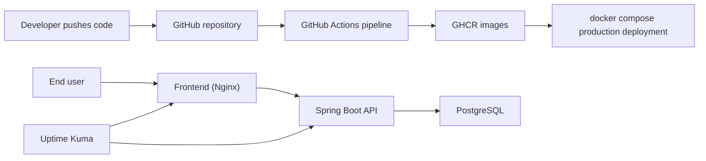

# KAMKA IT Assessment Notes

## Architecture summary

This project uses a minimal three-tier design:

- Nginx serves the frontend and proxies `/api` requests
- Spring Boot exposes the Todo REST API and health endpoints
- PostgreSQL stores the Todo data
- Uptime Kuma monitors service health

## Key technical decisions

### Why a static frontend?

The assessment is about infrastructure quality, not frontend complexity. A static frontend keeps the focus on:

- Docker image quality
- service boundaries
- reverse proxying
- CI/CD clarity

### Why GitHub Actions?

GitHub Actions keeps the workflow close to the source code and removes the need for an external Jenkins server. It is easier for a reviewer to inspect and rerun.

### Why Uptime Kuma?

It is lightweight, easy to demo locally, and directly answers the operational question: "Are the services up?"

### How secrets are handled

- Real secrets live in `.env` or GitHub Secrets
- `.env.example` documents required values
- No credentials are committed

## Dev/prod parity

Development and production use the same services and almost the same Compose topology. The main difference is the source of the images:

- development builds locally
- production pulls versioned images from GHCR

This keeps the runtime environment consistent while still demonstrating a realistic image publishing flow.

## Known limitations

- Uptime Kuma monitors are not auto-provisioned on first boot; they must be added once through the UI
- Live deployment requires a Linux host with Docker and a configured `.env`
- The app is intentionally small and does not include authentication or advanced rollback orchestration

## What I would improve with more time

- Provision a free Linux host and complete a public deployment
- Add HTTPS with Caddy or Traefik
- Add database backups and a rollback script
- Add infrastructure automation with Terraform or Ansible
